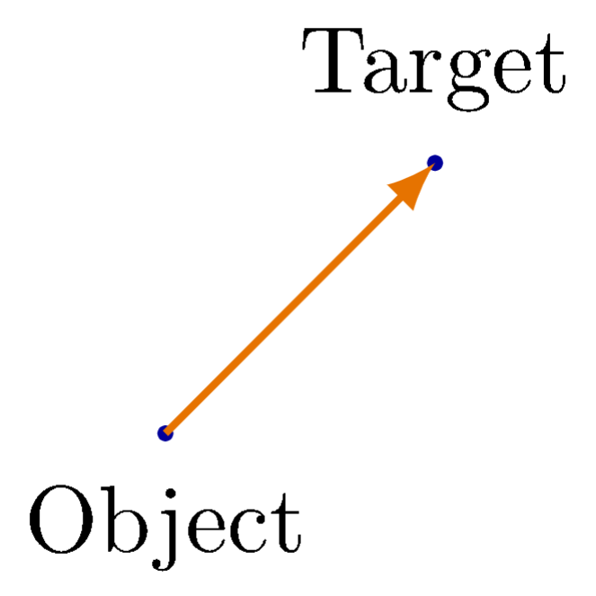
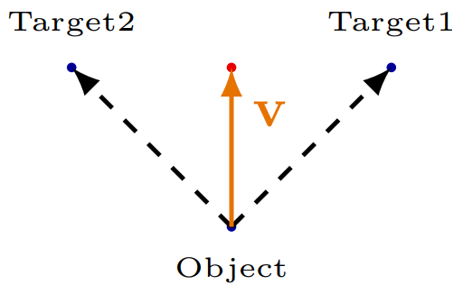

# Object Motion with Potential Vectors

### Guo Xiaoyang 2022, Nov.18

## Table of content

- Math Walkthrough
- Preditor-prey Model
- Making creature more vivid

## Math and Theory Behind Potential Functions

### A Naive Point of View

The motion of an object is defined by its velocity vector, which has a direction and a speed. In the nature, a creature may rest, stroll, chase or decamp. This section will focus on chasing and decamping, which are essentially the same mechenism in terms of implementation, with only opposite dircections. Stroll will be discussed in following sections.

To make a object chase a target, the most intuitive method would be finding the vector from this object to the target, and using this vector to be the velocity——which works, but have some issues. First, the object will become slower as it get closer to the target. This may be desired in some specific situations, but is definetly not suitable for all situations. This issue can be addressed by normalize the vector and mutiply with a speed value. As you would see, no matter what method we use to compute the velocity vector, this operation will be preserved. Secondly, this method cannot really deal with situations where multiple target present in the space. The natural solution is to simply add up all the vectors from the object to each target. However this is not really a generic solution. For example, if there are two targets, then the object will move to the middle of the two target and stop there no matter where it begins\*. Once again, this is not suitable for most situations. 

So the task in front of us is to avoid equilibriums as much as possible. One method is to make the closer targets more "attractive" to the target. If this is true, then the object will go to not the middle point between the targets, but the closer target instead, which is desirable for most situations. How do we do this? Remember we metioned that without normalization, the velocity vector will become smaller and smaller as it approach the target, which means the inverse become larger and larger. Furthermore, by increase the power of the dinominator, the attraction of closer targets will be higher and higher compare to the targets that are further. Keep this in mind when you try to work out the math in next part of this section.

### Gradient Descent

With the conceptual understanding, let's take a look at the math.

## Preditor-prey Model
